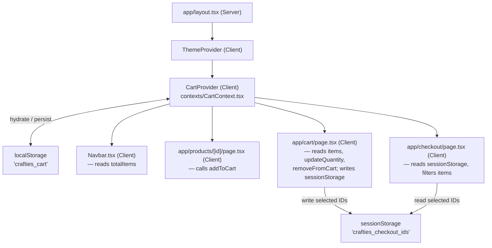

# Design Document: Cart Feature

## Overview

This design replaces all disconnected, hardcoded cart data across the Crafties application with a
single shared state managed by React Context API and persisted to `localStorage`. The change
touches five files (one new context, one updated type file, three updated pages/components) and
adds one new wrapping provider in `app/layout.tsx`.

The project runs **Next.js 16** with the App Router, React 19, TypeScript, and Tailwind CSS. All
context providers must be Client Components (`"use client"`). The root layout is a Server Component;
the pattern confirmed by the Next.js 16 docs is to import a `"use client"` provider into a Server
Component layout and wrap `{children}` with it.

---

## Architecture



**Key architectural decisions:**

- `CartProvider` sits _inside_ `ThemeProvider` in `app/layout.tsx`, matching the requirement and
  the existing nesting convention.
- All localStorage access is guarded with `typeof window !== "undefined"` to prevent SSR errors
  during Next.js prerendering (Client Components are prerendered to HTML at build/request time).
- Navigation from the Cart Page to `/checkout` uses `router.push("/checkout")` from
  `useRouter` (`next/navigation`) inside an event handler, so `sessionStorage` can be written
  _before_ navigation begins — impossible with a plain `<Link>`.
- Duplicate detection in `addToCart` keys on `productId` combined with
  `JSON.stringify(Object.keys(selectedVariants).sort().reduce(...))` so variant-map comparison is
  order-independent.

---

## Components and Interfaces

### `types/cart.ts`

```ts
export interface CartItem {
  id: string;               // unique cart-line ID (crypto.randomUUID or Date.now fallback)
  productId: string;
  name: string;
  price: number;
  image: string;
  selectedVariants: Record<string, string>; // e.g. { "Warna": "Hitam", "Ukuran": "M" }
  quantity: number;
  store: string;
}
```

### `contexts/CartContext.tsx`

```ts
// Public surface exposed through useCart()
interface CartContextValue {
  items: CartItem[];
  totalItems: number;                                         // sum of all item.quantity
  addToCart: (item: Omit<CartItem, "id">) => void;
  removeFromCart: (cartItemId: string) => void;
  updateQuantity: (cartItemId: string, quantity: number) => void;
  clearCart: () => void;
}
```

The file exports:
- `CartProvider` — the wrapping client component
- `useCart()` — the consumer hook (throws if used outside provider)

### `components/Navbar.tsx`

Adds `useCart()` to read `totalItems`. Replaces the static `.w-2.h-2` blue dot with a conditional
numeric badge:

```tsx
{totalItems > 0 && (
  <span className="absolute -top-1 -right-1 min-w-[18px] h-[18px] ...">
    {totalItems > 99 ? "99+" : totalItems}
  </span>
)}
```

### `app/products/[id]/page.tsx`

Replaces the local `handleAddToCart` stub with a real call:

```ts
const { addToCart } = useCart();

const handleAddToCart = () => {
  addToCart({
    productId: product.id,
    name: product.product.name,
    price: product.product.price,
    image: product.images[0],
    store: product.product.badge,
    selectedVariants,
    quantity: qty,
  });
  setAddedToCart(true);
  setTimeout(() => setAddedToCart(false), 2500);
};
```

### `app/cart/page.tsx`

- Removes `INITIAL_CART` and local `items`/`setItems` state.
- Reads `items` from `useCart()`; calls `updateQuantity` and `removeFromCart` from context.
- Maintains local `selected: Set<string>` state for checkbox UI only.
- The checkout CTA becomes a `<button>` that writes `sessionStorage` then calls `router.push`.

### `app/checkout/page.tsx`

- Removes `CHECKOUT_ITEMS` constant.
- On mount (via `useEffect` or lazy `useState` initializer), reads
  `sessionStorage.getItem("crafties_checkout_ids")`.
- Filters `items` from `useCart()` to the stored IDs (fallback: all items).
- Derives `subtotal`, `shippingCost` (15 000), `adminFee` (1 000), `total` from filtered items.

---

## Data Models

### CartItem (canonical)

| Field              | Type                     | Notes                                              |
|--------------------|--------------------------|----------------------------------------------------|
| `id`               | `string`                 | Generated at add time; unique per cart line        |
| `productId`        | `string`                 | Matches `Product.id`                               |
| `name`             | `string`                 |                                                    |
| `price`            | `number`                 | Unit price in IDR                                  |
| `image`            | `string`                 | URL path                                           |
| `selectedVariants` | `Record<string, string>` | Keys = variant group labels, values = option names |
| `quantity`         | `number`                 | ≥ 1                                                |
| `store`            | `string`                 | Seller/badge name                                  |

### localStorage schema

Key: `"crafties_cart"` → `JSON.stringify(CartItem[])`

### sessionStorage schema

Key: `"crafties_checkout_ids"` → `JSON.stringify(string[])` — array of `CartItem.id` values
representing user-selected lines.

### Duplicate detection key

```ts
function variantKey(selectedVariants: Record<string, string>): string {
  return JSON.stringify(
    Object.keys(selectedVariants)
      .sort()
      .reduce((acc, k) => ({ ...acc, [k]: selectedVariants[k] }), {})
  );
}

// Two items are duplicates when:
item.productId === newItem.productId &&
variantKey(item.selectedVariants) === variantKey(newItem.selectedVariants)
```

### Variant display string derivation

```ts
function formatVariants(selectedVariants: Record<string, string>): string {
  return Object.entries(selectedVariants)
    .map(([k, v]) => `${k}: ${v}`)
    .join(", ");
}
// e.g. { "Warna": "Hitam", "Ukuran": "M" } → "Warna: Hitam, Ukuran: M"
// Empty object → ""
```

---

## Correctness Properties

*A property is a characteristic or behavior that should hold true across all valid executions of a
system — essentially, a formal statement about what the system should do. Properties serve as the
bridge between human-readable specifications and machine-verifiable correctness guarantees.*

### Property 1: Variant display string contains all entries

*For any* `Record<string, string>` of selected variants, the formatted display string SHALL
contain every key and its corresponding value, and entries SHALL be separated by `", "`.

**Validates: Requirements 1.3, 5.5**

---

### Property 2: localStorage round-trip preserves cart

*For any* array of `CartItem` objects, serializing the cart to `localStorage` and then
deserializing it SHALL produce a structurally equivalent array (same items, same order, same field
values).

**Validates: Requirements 2.1, 2.2**

---

### Property 3: addToCart duplicate increments quantity, not count

*For any* cart that already contains an item with a given `productId` and `selectedVariants`
combination, calling `addToCart` with that same combination SHALL result in the same number of
cart lines, with the matching item's `quantity` increased by the supplied amount.

**Validates: Requirements 2.4**

---

### Property 4: totalItems equals sum of all quantities

*For any* cart state, `totalItems` SHALL equal the arithmetic sum of `quantity` across every
`CartItem` in `items`.

**Validates: Requirements 2.6**

---

### Property 5: updateQuantity < 1 removes the item

*For any* cart item, calling `updateQuantity` with a value less than 1 SHALL result in that item
being absent from the resulting `items` array.

**Validates: Requirements 2.5**

---

### Property 6: Delete All removes exactly the selected items

*For any* cart and any non-empty subset of selected item IDs, invoking "Delete All" SHALL produce
a cart whose `items` array contains none of the previously selected IDs, while retaining all
unselected items unchanged.

**Validates: Requirements 4.4**

---

### Property 7: Checkout CTA writes exactly the selected IDs to sessionStorage

*For any* set of selected cart item IDs, clicking the checkout CTA SHALL write a JSON array to
`sessionStorage` under `"crafties_checkout_ids"` that contains exactly those IDs — no more, no
fewer.

**Validates: Requirements 4.7**

---

### Property 8: Checkout Page filter preserves exactly the stored IDs

*For any* cart array and any list of stored IDs, the filtered items used on the Checkout Page SHALL
contain exactly and only the `CartItem` objects whose `id` is present in the stored IDs list.

**Validates: Requirements 5.2**

---

### Property 9: Checkout totals are arithmetically correct

*For any* list of filtered checkout items, the derived `subtotal` SHALL equal the sum of
`price × quantity` for each item, and `total` SHALL equal `subtotal + 15000 + 1000`.

**Validates: Requirements 5.4**

---

### Property 10: Badge label is correct for all counts

*For any* `totalItems` value: when it is 0 the badge SHALL be hidden; when it is between 1 and 99
inclusive the badge SHALL display the exact numeric string; when it is 100 or greater the badge
SHALL display `"99+"`.

**Validates: Requirements 6.1, 6.2, 6.3**

---

## Error Handling

| Scenario | Handling |
|---|---|
| `localStorage` unavailable (SSR, private browsing, quota exceeded) | `try/catch` around all `localStorage` calls; initialize with `[]` on error; suppress error silently |
| `sessionStorage` unavailable or key missing on Checkout Page | Fall back to displaying all cart items |
| `JSON.parse` failure on stored cart data | Catch and reset to `[]`; log warning in development |
| `addToCart` called with `quantity` ≤ 0 | Treat as `quantity: 1` (clamp) |
| `updateQuantity` called with quantity < 1 | Remove item (requirement 2.5) |
| Product detail page with no variant selected | `selectedVariants = {}`; `addToCart` still called (requirement 3.3) |

---

## Testing Strategy

This feature has a mix of pure logic (variant formatting, cart reducer operations, total
derivations) and UI wiring. Both unit/example tests and property-based tests are appropriate.

### Property-Based Testing

**Library**: [fast-check](https://github.com/dubzzz/fast-check) — works in Node/Jest, no browser
required, has TypeScript types, and supports arbitrary generators for records and arrays.

Each property test runs a **minimum of 100 iterations**. Each test is tagged with a comment
referencing the design property it validates:

```
// Feature: cart-feature, Property N: <property text>
```

**Properties to implement as PBT (pure functions, no DOM required):**

| Property | Target function | Generators needed |
|---|---|---|
| 1 | `formatVariants(selectedVariants)` | `fc.dictionary(fc.string(), fc.string())` |
| 2 | `CartProvider` reducer / serialize+deserialize | `fc.array(cartItemArb)` |
| 3 | `cartReducer` ADD_ITEM action | `fc.array(cartItemArb)`, `fc.record(...)` |
| 4 | `totalItems` derived value | `fc.array(cartItemArb)` |
| 5 | `cartReducer` UPDATE_QUANTITY action | `fc.array(cartItemArb)`, `fc.integer({max:0})` |
| 6 | Cart Page "Delete All" logic | `fc.array(cartItemArb)`, `fc.set(...)` |
| 7 | Cart Page sessionStorage write | `fc.set(fc.uuid())` |
| 8 | Checkout Page filter | `fc.array(cartItemArb)`, `fc.array(fc.uuid())` |
| 9 | Checkout totals derivation | `fc.array(cartItemArb)` |
| 10 | Badge label formatter | `fc.integer({min:0})` |

**Properties NOT suitable for PBT (use example-based tests instead):**

- 2.1 / 2.7: localStorage hydration — environment-dependent, single example test with mock
- 3.1–3.3: UI wiring on product detail page — rendered component tests with mock context
- 4.1–4.3, 4.6: UI wiring on cart page — rendered component tests
- 5.1, 5.3: sessionStorage hydration edge cases — example tests
- 6.4: `'use client'` directive presence — static analysis / build check

### Unit / Integration Tests

- `CartProvider` hydration from `localStorage` mock (example)
- `CartProvider` persists on state change (example)
- Product detail: "Add to cart" button calls `addToCart` with correct payload (example with
  React Testing Library + mock context)
- Cart page: quantity stepper, remove button, select-all, CTA disabled state (example tests)
- Checkout page: fallback when `sessionStorage` is empty (example)
- Navbar: badge hidden at 0, shows number at 1–99, shows "99+" above 99 (covered by Property 10,
  plus one snapshot/render test for DOM presence)
